# Diagrama de Arquitectura — Incendios Valle del Sol

```mermaid
graph TB
    subgraph "Usuarios"
        CIUDADANO[Ciudadano]
        ADMIN[Admin Municipal]
        VECINO[Vecino]
    end

    subgraph "Frontend PWA"
        PWA["React + TypeScript + Tailwind<br/>incendios-valle.pages.dev"]
        CF_PAGES["Cloudflare Pages<br/>Auto-deploy desde GitHub"]
        SW[Service Worker<br/>Soporte offline]
        ADMIN_DASH["Dashboard Admin (PWA)<br/>5 tabs: Usuarios, Auditoría,<br/>Notificaciones, Reportes, 2FA<br/>Ruta: /admin"]
    end

    subgraph "Edge"
        CF_WORKER["Cloudflare Worker<br/>CORS proxy + rate limit"]
        DNS["Cloudflare DNS-only<br/>api.keogh.lat"]
    end

    subgraph "API Gateway"
        AG["API Gateway<br/>HTTP_PROXY"]
    end

    subgraph "EC2 t3.micro — 5 contenedores Docker"
        nginx["nginx reverse proxy<br/>+ /nginx-health"]
        API["FastAPI BFF<br/>45 endpoints, 8 routers"]
        GRAFANA["Grafana 10.4.8<br/>2 dashboards provisionados"]
        G_DASH1["Dashboard Táctico<br/>12 paneles, refresh 3s<br/>SQLite datasource"]
        G_DASH2["Dashboard DevOps<br/>6 paneles, refresh 30s<br/>Prometheus datasource"]
        PROM["Prometheus<br/>scrape node_exporter:9100"]
        NODE["Node Exporter<br/>CPU, RAM, disco, red"]
        SQLITE[(SQLite<br/>incendios.db)]
    end

    subgraph "Microservicios Lambda"
        UP["upload-proxy<br/>Subida imágenes S3"]
        USR["ms-usuarios<br/>Login / Registro DynamoDB"]
        INC["ms-incidencias<br/>CRUD Reportes DynamoDB"]
        NOT["ms-notificaciones<br/>Publicación SNS Alertas"]
        SNS2G["sns-to-grafana<br/>Anotaciones desde SNS"]
    end

    subgraph "AWS Persistencia"
        DDB[(DynamoDB<br/>Usuarios + Reportes)]
        S3[(S3<br/>Imágenes)]
        SNS["SNS Topic<br/>incendios-alerts"]
    end

    subgraph "APIs Externas"
        FIRMS["NASA FIRMS<br/>Focos de calor satelitales"]
        OWM["OpenWeatherMap<br/>Clima 30-30-30"]
        CONAF["CONAF / CIREN<br/>Datos históricos incendios"]
        MAILTRAP["Mailtrap SMTP<br/>OTP 2FA + password reset"]
        MAPBOX["Mapbox GL JS<br/>Mapas base + geocoding"]
    end

    subgraph "CI/CD (GitHub Actions)"
        GH["push a main"]
        BACKEND_TESTS["1. pytest backend<br/>168 tests"]
        FRONTEND_TESTS["2. npm test frontend<br/>177 tests"]
        SONAR["3. SonarCloud scan<br/>A en 4 dimensiones"]
        DOCKER["4. Docker build + push<br/>Docker Hub"]
        SCP["5. SCP sync<br/>config + provisioning"]
        SSH["6. SSH deploy<br/>refresh_api.sh"]
    end

    %% Conexiones Frontend
    CIUDADANO --> PWA
    ADMIN --> PWA
    ADMIN --> ADMIN_DASH
    VECINO --> PWA
    PWA --> SW
    ADMIN_DASH --> CF_WORKER
    CF_PAGES -.->|push a main| PWA

    %% Flujo principal
    PWA --> CF_WORKER
    CF_WORKER --> AG
    AG --> nginx
    nginx --> API

    %% API interna
    API --> SQLITE
    API -->|envía anotaciones| GRAFANA
    API --> nginx

    %% Grafana datasources
    GRAFANA --- G_DASH1
    GRAFANA --- G_DASH2
    G_DASH1 -->|frser-sqlite-datasource| SQLITE
    G_DASH2 -->|Prometheus datasource| PROM
    NODE -->|host metrics :9100| PROM

    %% API a AWS
    API --> DDB
    API --> S3
    API --> SNS

    %% Lambdas
    UP --> S3
    USR --> DDB
    INC --> DDB
    NOT --> SNS
    SNS2G -->|HTTP POST| GRAFANA

    %% APIs externas
    API --> FIRMS
    API --> OWM
    API --> CONAF
    API --> MAILTRAP
    PWA -->|Mapbox GL JS| MAPBOX

    %% Sync Lambda → API
    USR -.->|POST /sync| API
    INC -.->|POST /sync| API

    %% CI/CD pipeline
    GH --> BACKEND_TESTS --> FRONTEND_TESTS --> SONAR --> DOCKER --> SCP --> SSH
    SSH -.->|docker-compose up -d| nginx
    SSH -.->|restart condicional| GRAFANA
    SSH -.->|restore desde S3| SQLITE

    %% Labels
    classDef frontend fill:#e1f5fe,stroke:#0288d1
    classDef edge fill:#e0f7fa,stroke:#00695c
    classDef compute fill:#e8f5e9,stroke:#388e3c
    classDef aws fill:#f3e5f5,stroke:#7b1fa2
    classDef external fill:#fce4ec,stroke:#c62828
    classDef db fill:#fff8e1,stroke:#f9a825
    classDef cicd fill:#f5f5f5,stroke:#616161
    classDef dashboard fill:#fff3e0,stroke:#ef6c00

    class PWA,SW,CF_PAGES,ADMIN_DASH frontend
    class CF_WORKER,DNS,AG edge
    class nginx,API,GRAFANA,PROM,NODE compute
    class G_DASH1,G_DASH2 dashboard
    class UP,USR,INC,NOT,SNS2G aws
    class FIRMS,OWM,CONAF,MAILTRAP,MAPBOX external
    class DDB,S3,SNS,SQLITE db
    class GH,BACKEND_TESTS,FRONTEND_TESTS,SONAR,DOCKER,SCP,SSH cicd
```

## Descripción del flujo

1. **Usuario** accede a la PWA en `incendios-valle.pages.dev` (Cloudflare Pages con auto-deploy desde GitHub)
2. La PWA se comunica vía **Cloudflare Worker** (CORS + rate limit) → **API Gateway** (DNS-only) → **nginx** → **FastAPI BFF** (EC2)
3. **FastAPI** (BFF) orquesta datos desde: SQLite (reportes, alertas, auditoría), DynamoDB (usuarios, reportes), S3 (imágenes), APIs externas (NASA FIRMS, OpenWeatherMap, CONAF/CIREN)
4. **Grafana** tiene **2 dashboards** con refresh independiente:
   - **Dashboard Táctico** (3s): SQLite datasource — 12 paneles (focos activos, clima 30-30-30, geomap con cross-filtering, FIRMS satelital, CONAF, recursos)
   - **Dashboard DevOps** (30s): Prometheus datasource — 6 paneles (CPU, RAM, disco, red, healthcheck API, alertas recientes)
5. **Prometheus** scrapea `node_exporter` cada 15s para métricas del servidor EC2
6. **5 Lambdas** manejan operaciones específicas: upload-proxy (S3), ms-usuarios (DynamoDB), ms-incidencias (DynamoDB), ms-notificaciones (SNS), sns-to-grafana (anotaciones)
7. **Sincronización**: Lambdas replican DynamoDB → SQLite vía `POST /sync`
8. **Mailtrap SMTP** envía OTP para 2FA y recuperación de contraseña
9. **CI/CD**: push a `main` → pytest backend (168) → npm test frontend (177) → SonarCloud → Docker build/push → SCP config → SSH deploy con restore SQLite desde S3

## Tecnologías

| Componente | Tecnología |
|------------|-----------|
| Frontend | React 18, TypeScript, Vite, Tailwind CSS, Mapbox GL JS |
| API | Python 3.11+, FastAPI, uvicorn |
| Lambdas | Python 3.11+, boto3 |
| Base de datos primaria | DynamoDB (AWS) |
| Base de datos secundaria | SQLite (WAL mode, busy_timeout) |
| Almacenamiento imágenes | S3 (AWS) |
| Mensajería | SNS (AWS) |
| Dashboard Táctico | Grafana 10.4.8 + frser-sqlite-datasource |
| Dashboard DevOps | Grafana 10.4.8 + Prometheus datasource |
| Monitoreo servidor | Prometheus + Node Exporter |
| Contenedores | Docker, docker-compose (5 contenedores) |
| CI/CD | GitHub Actions (4 workflows) |
| Edge/DNS | Cloudflare (DNS-only + Workers) |
| Correo | Mailtrap SMTP |
| Mapas | Mapbox GL JS (+ Leaflet en previews) |
