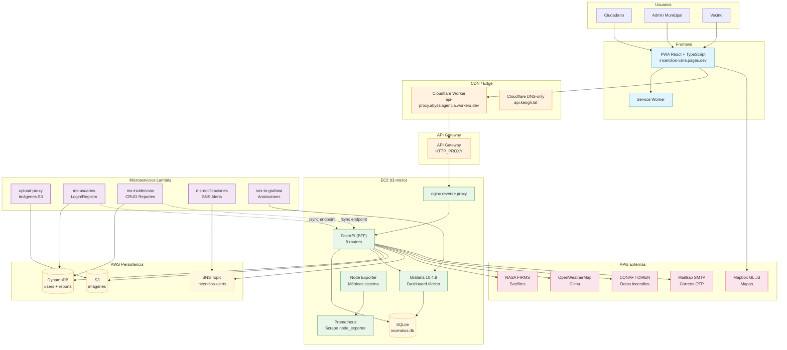

# Diagrama de Arquitectura — Incendios Valle del Sol

## Descripción del flujo

1. **Usuario** accede a la PWA en `incendios-valle.pages.dev`
2. La PWA se comunica via **Cloudflare Worker** (proxy CORS) → **API Gateway** → **nginx** → **FastAPI** (EC2)
3. **FastAPI** (BFF) orquesta datos desde:
   - **SQLite**: reportes, alertas, auditoría (para Grafana + admin)
   - **DynamoDB**: usuarios, reportes (para Lambdas)
   - **S3**: imágenes de reportes
   - **APIs externas**: NASA FIRMS, OpenWeatherMap, CONAF/CIREN
4. **Grafana** se conecta directamente a SQLite para dashboards tácticos
5. **5 Lambdas** manejan operaciones específicas sin servidor
6. **Mailtrap** envía OTPs por correo para 2FA y password reset
7. **CI/CD**: GitHub Actions → Docker build/push → SCP + SSH deploy a EC2

## Tecnologías

| Componente | Tecnología |
|------------|-----------|
| Frontend | React 18, TypeScript, Vite, Tailwind CSS, Mapbox GL JS |
| API | Python 3.11+, FastAPI, uvicorn |
| Lambdas | Python 3.11+, boto3 |
| Base de datos primaria | DynamoDB (AWS) |
| Base de datos secundaria | SQLite (WAL mode) |
| Almacenamiento imágenes | S3 (AWS) |
| Mensajería | SNS (AWS) |
| Dashboard | Grafana 10.4.8 |
| Contenedores | Docker, docker-compose |
| CI/CD | GitHub Actions |
| Edge/DNS | Cloudflare (DNS-only) |
| Correo | Mailtrap SMTP |
| Mapas | Mapbox GL JS |
